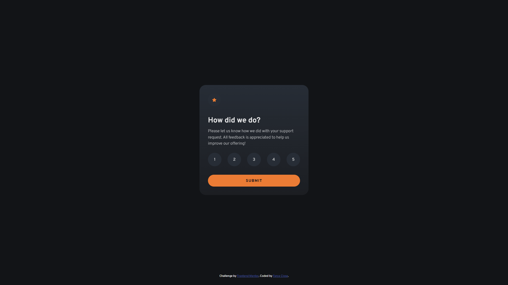

# Fluid and Interactive Rating Component using CSS clamp() & Vanilla JS

This is a solution to the [Interactive rating component challenge on Frontend Mentor](https://www.frontendmentor.io/challenges/interactive-rating-component-koxpeBUmI). Frontend Mentor challenges help you improve your coding skills by building realistic projects.

## Table of contents

- [Overview](#overview)
  - [The challenge](#the-challenge)
  - [Screenshot](#screenshot)
  - [Links](#links)
- [My process](#my-process)
  - [Built with](#built-with)
  - [What I learned](#what-i-learned)
  - [Continued development](#continued-development)
  - [Useful resources](#useful-resources)
  - [AI Collaboration](#ai-collaboration)
- [Author](#author)
- [Acknowledgments](#acknowledgments)

## Overview

### The challenge

Users should be able to:

- View the optimal layout for the app depending on their device's screen size
- See hover states for all interactive elements on the page
- Select and submit a number rating
- See the active state of the rating number they selected before submitting
- Get alert message and shake animation when submitting an empty rating
- See the "Thank you" card state after submitting a rating

### Screenshot



### Links

- Solution URL: [solution URL](https://www.frontendmentor.io/solutions/fluid-and-interactive-rating-component-using-css-clamp-and-vanilla-js-XfFKUHjnSh)
- Live Site URL: [live site URL](https://forceclose-interactive-rating-component.vercel.app/)

## My process

### Built with

- Semantic HTML5 markup
- CSS custom properties (Variables)
- Flexbox
- CSS Grid
- CSS Logical Properties (e.g., `inline-size`, `block-size`, `padding-block`)
- CSS `clamp()` function for fluid and responsive design
- Vanilla JavaScript (DOM Manipulation, Event listeners, Timers)
- Mobile-first workflow

### What I learned

In this project, I significantly improved my understanding of combining JavaScript event listeners and CSS animations to create an interactive and responsive user experience.

On the JavaScript side, I learned about **Event Delegation**. Instead of adding an event listener to every single rating number, I added a single `click` event listener to the parent container (`.rating-wrapper`). Using `e.target.closest()`, I could efficiently determine which rating was clicked:

```javascript
ratingWrapper.addEventListener("click", function (e) {
  // Find the closest element with the class "rating"
  const ratingElement = e.target.closest(".rating");

  if (ratingElement) {
    ratingValue = ratingElement.getAttribute("data-value");
    // Styling updates follow...
  }
});
```

Another major highlight was learning how to implement a custom "shake" animation to visually alert users when they try to submit an empty rating. I defined the animation using `@keyframes`:

```css
.alert-animation {
  animation: shake 0.4s ease-in-out;
}

@keyframes shake {
  0%,
  100% {
    transform: translateX(0);
  }
  20%,
  60% {
    transform: translateX(-5px);
  }
  40%,
  80% {
    transform: translateX(5px);
  }
}
```

I also learned how to manage animation states by combining event listeners with `setTimeout`. This allows the shake animation to be re-triggered multiple times if the user repeatedly clicks the submit button without selecting a rating:

```javascript
// Trigger and reset the shake animation state after 400ms
ratingPage.classList.add("alert-animation");
setTimeout(() => {
  ratingPage.classList.remove("alert-animation");
}, 400);
```

### Continued development

In future projects, I want to focus on:

- **Accessibility (a11y)**: I want to dive deeper into making my web components fully accessible. This includes adding proper keyboard navigation (like using `Tab` and `Enter` to select ratings) and implementing ARIA attributes so screen readers can properly interpret the interactive states.
- **Advanced CSS Animations**: While implementing the custom shake animation was a great learning experience, I'd like to explore more complex state transitions and micro-interactions to make user interfaces feel even more polished.
- **State Management**: Managing the active states and form submissions with Vanilla JavaScript was highly educational. Next, I want to learn how modern frontend frameworks like React or Vue handle UI state for larger, more complex applications.

### Useful resources

- [Google Fonts](https://fonts.google.com/) - Provided the Overpass font family used throughout the project. A great free resource for web-safe fonts.
- [TinyPNG](https://tinypng.com/) - Helped me compress and optimize the images in the project without losing quality, making the page load faster.
- [Cloudinary](https://cloudinary.com/) - Used to host the Open Graph and Twitter card images for social media sharing.
- [Perfect Pixel](https://chrome.google.com/webstore/detail/perfectpixel-by-welldonec/dkaagdgjlophiddqccjgplachon0304v) - Chrome extension that allowed me to overlay the design mockup directly on my live page for pixel-perfect accuracy.
- [FontAwesome](https://fontawesome.com/) - A great library used for adding scalable vector icons easily throughout the project.
- [Inclusively Hiding and Styling Checkboxes and Radio Buttons](https://www.sarasoueidan.com/blog/inclusively-hiding-and-styling-checkboxes-and-radio-buttons/) - An excellent, comprehensive guide from Sara Soueidan on how to style custom checkboxes and radio buttons accessibly. Extremely helpful for building rating components or custom forms!

### AI Collaboration

In this project, I collaborated with an AI assistant (Gemini) to enhance my workflow, solve specific technical roadblocks, and deepen my understanding of modern web development concepts. Here is how I utilized AI:

- **Fluid Typography and Spacing**: I used AI to quickly calculate complex `clamp()` math values for font sizes, paddings, and margins based on my specific minimum and maximum viewport requirements.
- **Debugging SVGs**: AI helped me understand why my SVGs were collapsing to `0px` when using `block-size: auto` and guided me to implement the `viewBox` attribute as a best practice.
- **Interactive Animations**: I brainstormed with AI to implement the 'shake' animation using CSS `@keyframes` and JavaScript `setTimeout` to handle form validation errors.
- **SEO & Meta Tags**: AI assisted in generating and organizing Open Graph and Twitter Card tags to ensure the project looks great when shared on social media.

Working with AI allowed me to focus more on the core logic and design implementation while significantly speeding up repetitive calculations and debugging processes.

## Author

- GitHub - [Force Close](https://github.com/forceclosee)
- Frontend Mentor - [@forceclosee](https://www.frontendmentor.io/profile/forceclosee)
- X - [@forceclosee](https://x.com/forceclosee)

## Acknowledgments

Huge thanks to [ashkir](https://www.frontendmentor.io/profile/ashkir004) for suggesting to make the rating items keyboard-interactive.
